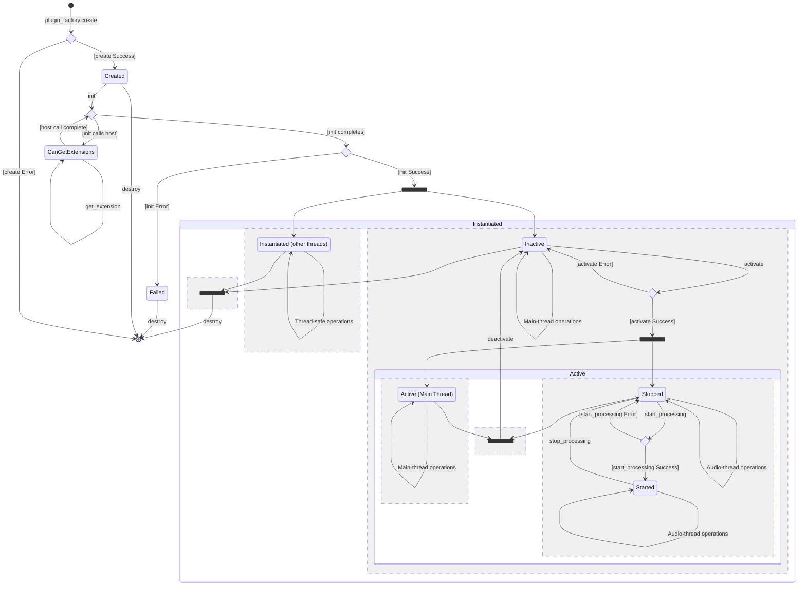
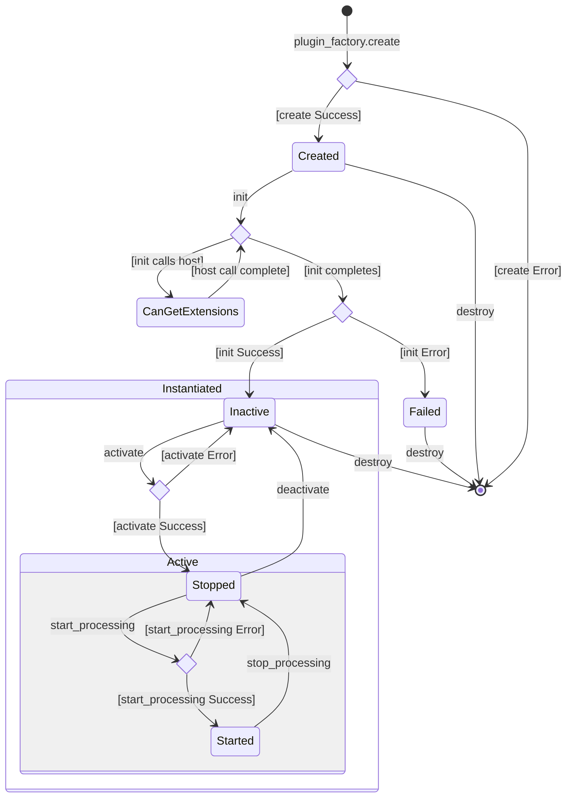

```mermaid
stateDiagram-v2
state create <<choice>>

[*] --> create: plugin_factory.create

create --> Created: [create Success]

state init_host_calls <<choice>>

Created --> init_host_calls: init
init_host_calls --> CanGetExtensions: [init calls host]
CanGetExtensions --> init_host_calls: [host call complete]
CanGetExtensions --> CanGetExtensions: get_extension

state init <<choice>>
init_host_calls --> init: [init completes]

init --> Failed: [init Error]

state init_success <<fork>>
init --> init_success: [init Success]

Failed --> [*]: destroy


init_success --> InstantiatedOtherThreads
init_success --> Inactive

state Instantiated {
    state before_destroy <<join>>
    InstantiatedOtherThreads --> before_destroy
    Inactive --> before_destroy
    --
    state InstantiatedOtherThreads
    InstantiatedOtherThreads: Instantiated (other threads)
    InstantiatedOtherThreads --> InstantiatedOtherThreads: Thread-safe operations
    --
    state activate <<choice>>

    state Inactive
    Inactive --> Inactive: Main-thread operations
    Inactive --> activate: activate
    activate --> Inactive: [activate Error]

    state activate_success <<fork>>
    activate --> activate_success: [activate Success]
    activate_success --> ActiveMainThread
    activate_success --> Stopped

    state Active {
        state before_deactivate <<join>>
        ActiveMainThread --> before_deactivate
        Stopped --> before_deactivate
        --
        state ActiveMainThread
        ActiveMainThread: Active (Main Thread)
        
        ActiveMainThread --> ActiveMainThread: Main-thread operations
        --
        state Stopped
        state Started
        state start <<choice>>
        
        Stopped --> start: start_processing
        start --> Started: [start_processing Success]
        start --> Stopped: [start_processing Error]
        Started --> Stopped: stop_processing
        Stopped --> Stopped: Audio-thread operations
        Started --> Started: process
        Started --> Started: Audio-thread operations
    }
}

before_deactivate --> Inactive: deactivate
before_destroy --> [*]: destroy
Created --> [*]: destroy
create --> [*]: [create Error]
```

```mermaid
stateDiagram-v2
state create <<choice>>

[*] --> create: plugin_factory.create

create --> Created: [create Success]

state init_host_calls <<choice>>

Created --> init_host_calls: init
init_host_calls --> CanGetExtensions: [init calls host]
CanGetExtensions --> init_host_calls: [host call complete]

state init <<choice>>
init_host_calls --> init: [init completes]

init --> Failed: [init Error]

init --> Inactive: [init Success]

Failed --> [*]: destroy

state Instantiated {
    state activate <<choice>>

    Inactive --> activate: activate
    activate --> Inactive: [activate Error]

    activate --> Stopped: [activate Success]
    Stopped --> Inactive: deactivate

    state Active {
        state Stopped
        state Started
        state start <<choice>>
        
        Stopped --> start: start_processing
        start --> Started: [start_processing Success]
        start --> Stopped: [start_processing Error]
        Started --> Stopped: stop_processing
    }
}

Inactive --> [*]: destroy
Created --> [*]: destroy
create --> [*]: [create Error]
```